# MLOps Churn Prediction Project

A production-ready MLOps pipeline for customer churn prediction with automated training, deployment, monitoring, and model versioning capabilities.

## 📋 Overview

This project implements an end-to-end machine learning operations (MLOps) workflow for predicting customer churn. It includes data generation, preprocessing, model training, versioning, API deployment, performance monitoring, and model rollback functionality.

## 🏗️ Project Structure

```
.
├── data/                   # Data storage
│   ├── processed.csv      # Cleaned and preprocessed data
│   └── raw.csv            # Original raw data
├── logs/                   # Application logs
│   └── predictions.log    # Prediction request logs
├── models/                 # Saved model artifacts
│   └── churn_model_v*.joblib
├── registry/               # Model registry and metadata
│   ├── current_model.txt  # Active model reference
│   ├── metadata.json      # Model version metadata
│   └── train_stats.json   # Training statistics
└── src/                    # Source code
    ├── api.py             # FastAPI prediction service
    ├── evaluate.py        # Model evaluation utilities
    ├── generate_data.py   # Synthetic data generation
    ├── monitor_drift.py   # Data/model drift detection
    ├── prepare_data.py    # Data preprocessing pipeline
    ├── rollback.py        # Model rollback functionality
    └── train.py           # Model training pipeline
```

## 🚀 Features

- **Automated Data Pipeline**: Generate synthetic data and preprocess features
- **Model Versioning**: Track multiple model versions with metadata
- **Model Registry**: Centralized registry for model management
- **REST API**: FastAPI-based prediction service
- **Performance Monitoring**: Log predictions and monitor model performance
- **Drift Detection**: Monitor for data and model drift
- **Model Rollback**: Revert to previous model versions if needed
- **Comprehensive Logging**: Track all predictions and system events

## 🛠️ Technology Stack

- **ML Framework**: scikit-learn
- **API Framework**: FastAPI
- **Data Processing**: pandas, numpy
- **Model Serialization**: joblib
- **Logging**: Python logging module

## 📦 Installation

```bash
# Clone the repository
git clone <repository-url>
cd <project-directory>

# Create virtual environment
conda create -n <my-env> python=3.10
conda activate <my-env>

# Install dependencies
pip install -r requirements.txt
```

## 🎯 Usage

### 1. Generate Data

```bash
python src/generate_data.py
```

### 2. Preprocess Data

```bash
python src/prepare_data.py
```

### 3. Train Model

```bash
python src/train.py
```

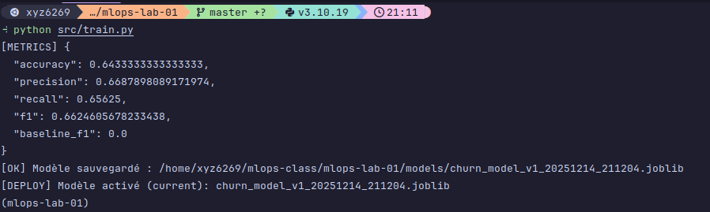

### 4. Evaluate Model

```bash
python src/evaluate.py
```

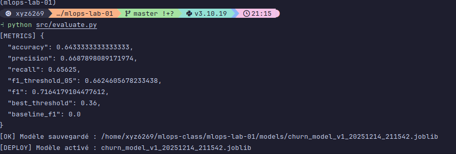

### 5. Start Prediction API

```bash
uvicorn src.api:app --reload
```

The API will be available at `http://localhost:8000`

### 6. Monitor Drift

```bash
python src/monitor_drift.py
```

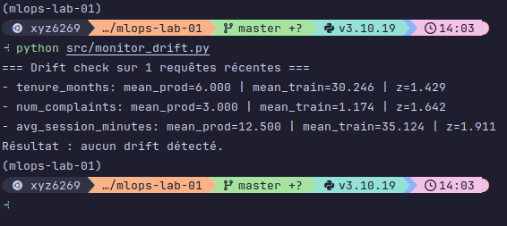

### 7. Rollback Model (if needed)

```bash
python src/rollback.py

#or towards a specific version using
python -c "from src.rollback import main; main('churn_model_v1_YYYYMMDD_HHMMSS.joblib')"
```

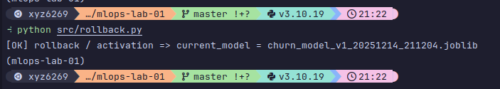

## 🔌 API Endpoints

### Health Check
```bash
GET /health

#example
curl -X GET http://127.0.0.1:8000/health 
```

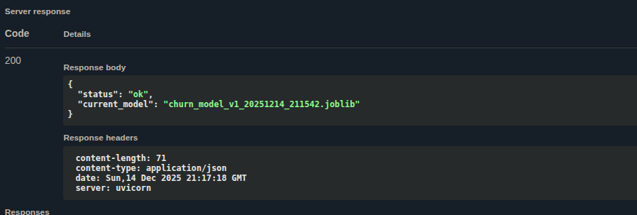

### Make Prediction
```bash
POST /predict
Content-Type: application/json

{
  "tenure_months": 200,
  "num_complaints": 50,
  "avg_session_minutes": 500,
  "plan_type": "string",
  "region": "string",
  "request_id": "string"
}

#example request
curl -X 'POST' \
  'http://localhost:8000/predict' \
  -H 'accept: application/json' \
  -H 'Content-Type: application/json' \
  -d '{
  "tenure_months": 48,
  "num_complaints": 0,
  "avg_session_minutes": 60,
  "plan_type": "premium",
  "region": "EU",
  "request_id": "req-safe"
}'
``` 

## 📊 Model Registry

The model registry maintains:
- **current_model.txt**: Reference to the active production model
- **metadata.json**: Version history, timestamps, and model lineage
- **train_stats.json**: Performance metrics for each trained model

## 🔍 Monitoring

- **Predictions**: Logged to `logs/predictions.log`
- **Drift Detection**: Monitors feature distributions and model performance
- **Performance Metrics**: Tracked in `registry/train_stats.json`

## 🔄 Model Lifecycle

1. **Training**: New models are trained and saved with version timestamps
2. **Evaluation**: Models are evaluated against validation data
3. **Registration**: Model metadata and statistics are recorded
4. **Deployment**: Best performing model is set as current
5. **Monitoring**: Production model is monitored for drift
6. **Rollback**: Can revert to previous versions if performance degrades


# TP3

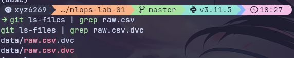

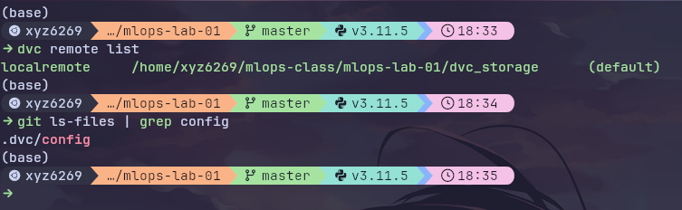

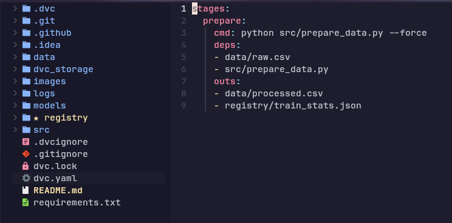

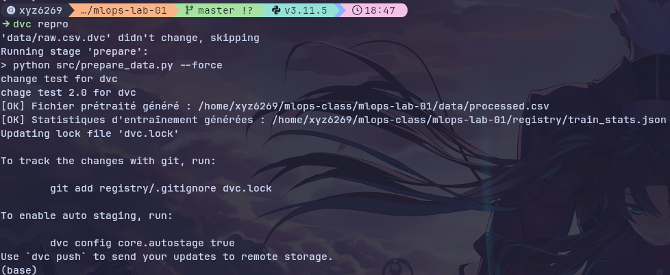

# TP 4

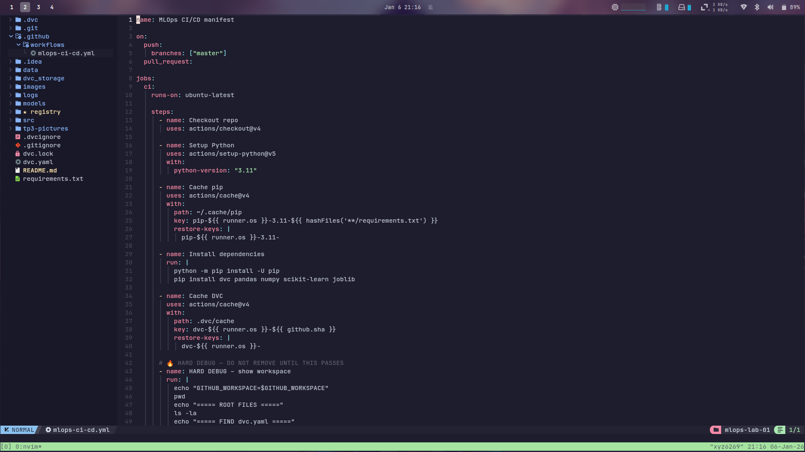

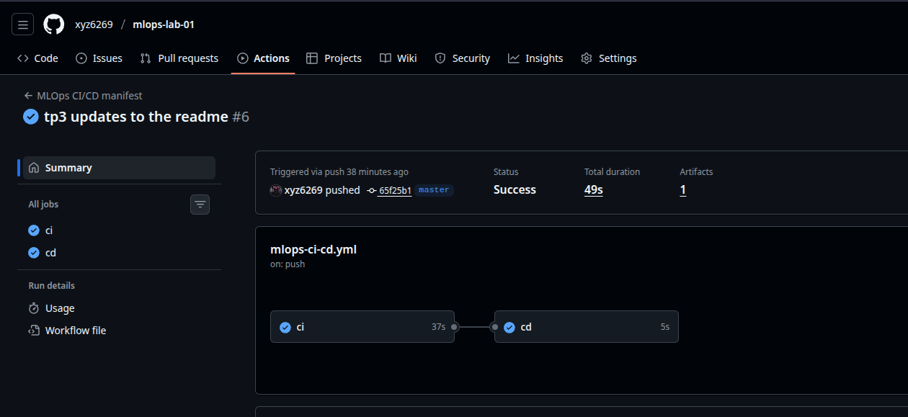


## 👥 Authors

Boulaamail Mohamed ali


